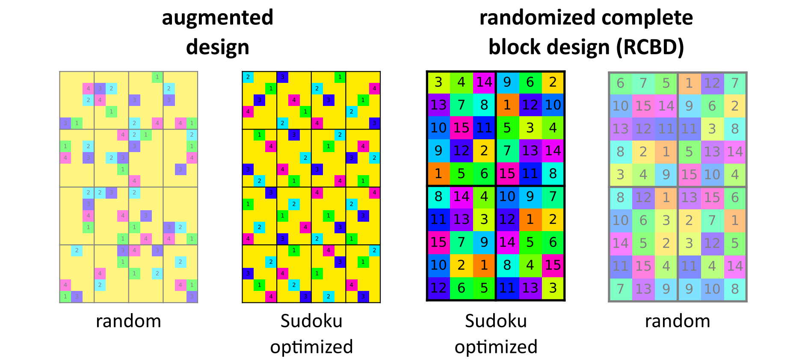
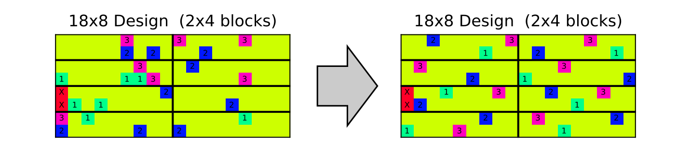

# SudokuPlantDesign.jl

Julia package for optimizing Sudoku-like field designs in plant breeding.




## Installation

You can install the package via the package mode in Julia (Pkg). However, since the package is not listed in the Julia package repositories, install it with its dependencies via
```julia-REPL
add BlockArrays DataFrames LinearAlgebra ProgressMeter PyPlot Random Statistics "https://github.com/janattig/SudokuPlantDesign.jl"
```

You can use the code after having it installed by importing the module as
```julia
using SudokuPlantDesign
```

Note, that for reading and saving data in `.xlsx` files (like it is done in the example notebooks), the package `XLSX` is required. Install it via
```julia-REPL
add XLSX
```


## Usage / Examples

For diving right in, we recommend following the example about augmented designs, which can be found [[here](examples/sudoku_augmented.ipynb)].

In total, you can find the following example files:
- example of an augmented Sudoku design including how to make a field plan [[notebook](examples/sudoku_augmented.ipynb)]
- example of a Sudoku randomized complete block design (RCBD) [[notebook](examples/sudoku_RCBD.ipynb)]
- basic usage example of the optimization process [[notebook](examples/sudoku_basic.ipynb)]
- extensive list of functions in the optimization process [[notebook](examples/full_list_of_functions_1_optimization.ipynb)]


## Background

This package is inspired by a publication of Vo-Tanh and Piepho (2020) (https://www.sciencedirect.com/science/article/abs/pii/S0167947320300797) with the idea of implementing augmented quasi-Sudoku designs in plant field trials. It aimed at optimizing the check distribution in e.g. augmented designs in plant breeding trials by avoiding clustering of checks.

Instead of finding the mathematical optimum as outlined in the paper, the package SudokuPlantDesign.jl allows for constructing configurations which serve as sufficiently good estimates to the optimal solution. This is achieved by optimizing check configurations in a combination of simulated annealing and classical Monte Carlo techniques and minimizing user-defined cost functions. In this process, configurations undergo a sequence of updates which incrementally improve the distribution of breeding candidates.



In practical use, the package allows to find good solutions for many popular experimental designs in plant breeding while remaining adaptible to the user requirements. For example, custom sizes of blocks, custom amounts of entries as well as L-shaped trials are possible to design. Missing plots can be defined before optimization and will be ignored in the allocation of checks and entries. Efficient code-runtime is achieved by only partial calculation of the cost functions in each update, as a lot of buffer variables keep track of other static parts. In practice, this means it takes only a few seconds until a design is optimized.
